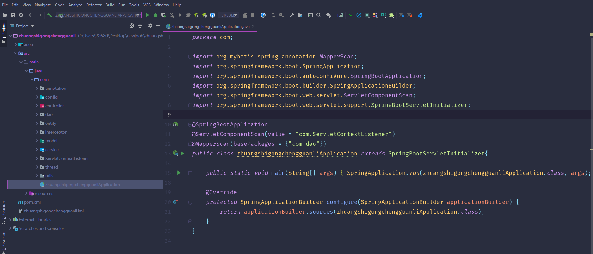
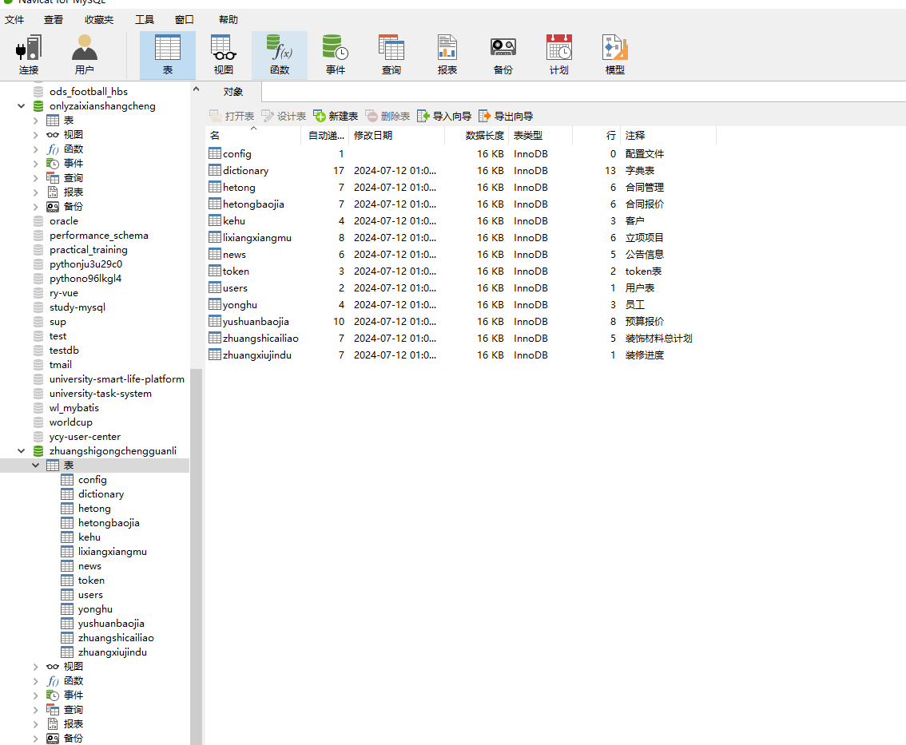
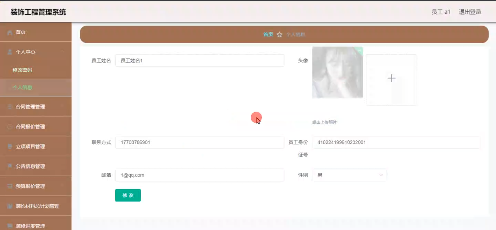
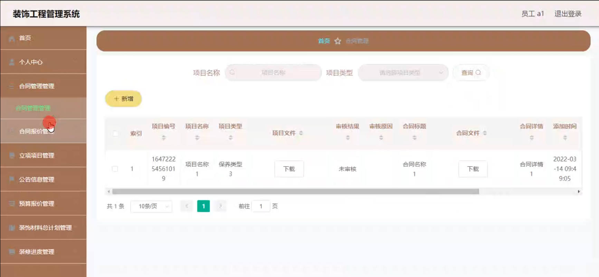
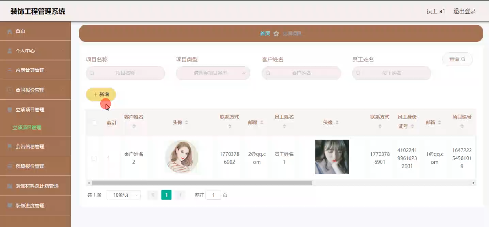
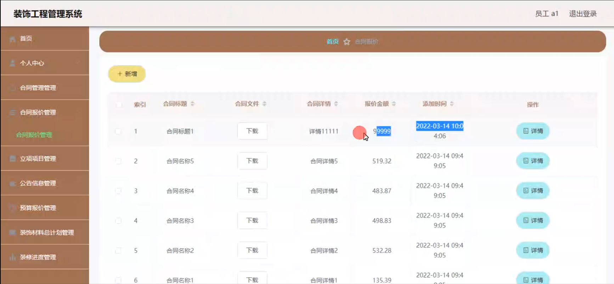
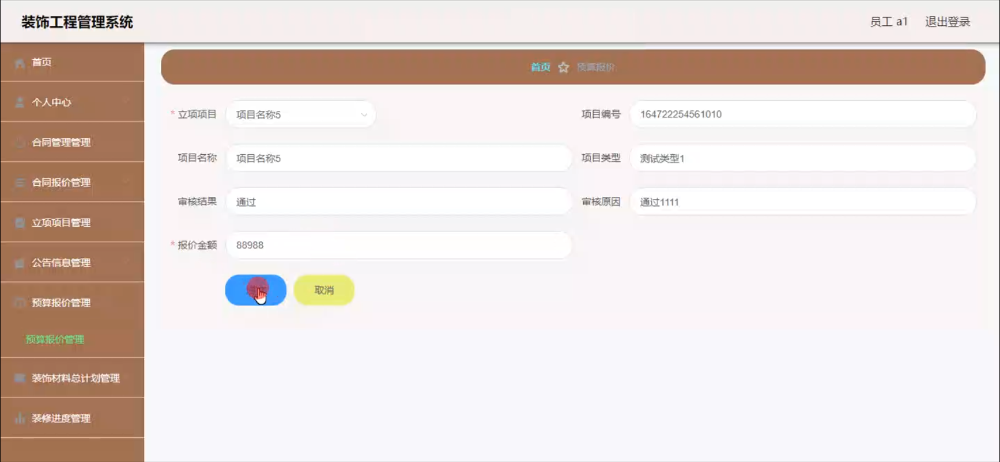
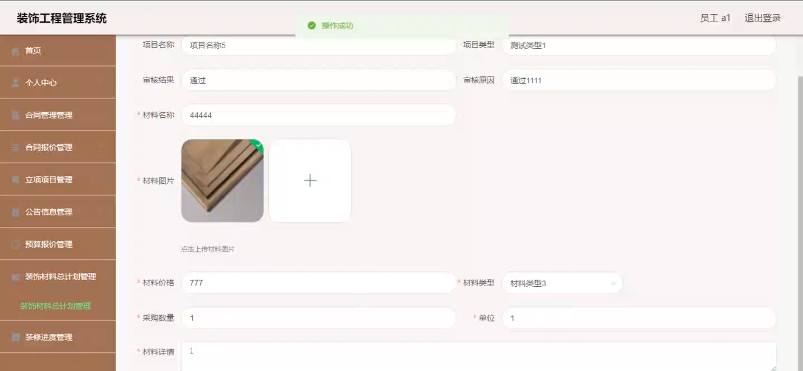
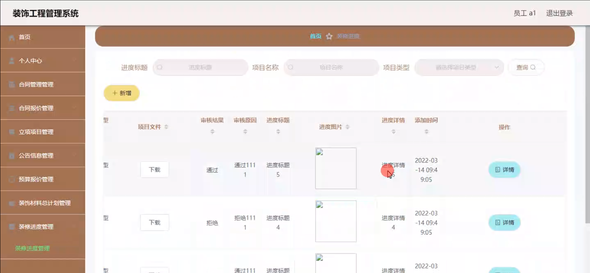
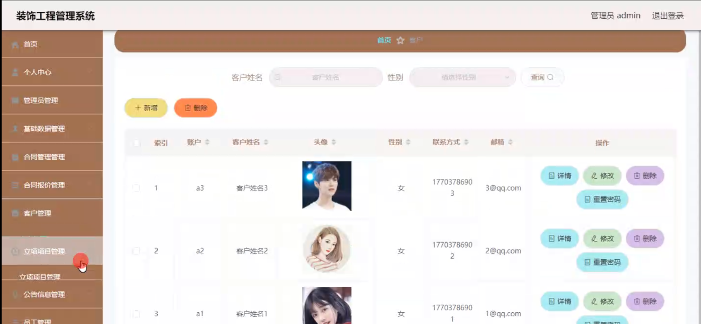

# 基于SpringBoot的装饰工程管理系统

#### 介绍

在装饰工程行业，高效的项目管理和资源协调对于项目的成功交付至关重要。为了满足这一需求，我们开发了基于 Spring Boot 的装饰工程管理系统，旨在为企业提供一个全面、便捷、高效的管理平台，提升装饰工程的管理水平和质量。

#### 技术栈

后端技术栈：Springboot+Mysql+Maven

前端技术栈：Vue+Html+Css+Javascript+ElementUI

开发工具：Idea+Vscode+Navicate

#### 系统功能介绍

（一）管理员角色  
个人中心：管理员可在个人中心查看和修改自己的个人信息，以及系统操作记录和通知。  
管理员管理：对其他管理员账号进行添加、删除、修改操作，设置不同管理员的权限和职责。  
基础数据管理：维护系统运行所需的基础数据，如工程项目类型、施工工艺标准、材料规格等。  
合同管理：全面管理装饰工程合同，包括合同的起草、审核、签订、执行、变更和终止等流程。  
合同报价管理：制定和审核合同报价，确保报价的合理性和准确性，同时监控报价的执行情况。  
客户管理：登记和维护客户信息，跟踪客户需求和反馈，为客户提供个性化服务。  
立项项目管理：对立项的装饰工程项目进行整体规划和安排，包括项目的目标、范围、时间节点、质量要求等。  
公告信息管理：发布和更新与装饰工程相关的公告信息，如项目进度通知、质量要求、安全注意事项等。  
员工管理：管理员工的基本信息、工作岗位、绩效考核等，合理调配人力资源。  
预算报价管理：负责装饰工程的预算编制和报价审核，控制项目成本。  
装饰材料总计划管理：制定装饰材料的采购计划和库存管理，确保材料的及时供应和合理库存。  
装修进度管理：实时监控装饰工程项目的进度，协调各方资源，确保项目按时完成。  

（二）员工角色  
个人中心：员工可以在个人中心查看和修改个人信息，了解工作任务和通知。  
合同管理：协助管理员处理合同相关事务，如合同的执行和跟踪。  
合同报价管理：参与合同报价的制定和执行工作。  
立项项目管理：按照项目规划执行具体的工作任务，及时汇报项目进展。  
公告信息管理：及时获取和了解公司发布的公告信息，按照要求开展工作。  
预算报价管理：协助进行预算编制和报价工作，提供相关数据和建议。  
装饰材料总计划管理：根据项目需求，参与装饰材料的计划和管理工作。  
装修进度管理：实时更新自己负责部分的装修进度，与团队成员协同工作。  

#### 系统作用

提高管理效率  
实现装饰工程业务流程的数字化和自动化，减少人工干预和重复劳动，提高工作效率和准确性。  
优化资源配置  
精确掌握项目进度、材料需求和人力资源状况，合理调配资源，降低成本，提高项目效益。  
增强客户满意度  
及时与客户沟通，满足客户需求，提高项目质量和交付时间，增强客户对企业的信任和满意度。  
提升决策科学性  
基于系统提供的数据分析和报表，管理层能够做出更科学的决策，规划企业发展战略。  
促进团队协作  
为管理员和员工提供统一的工作平台，加强信息共享和沟通，促进团队协作，提高项目执行能力。  

#### 系统功能截图

代码结构

数据库表

登录

员工端个人信息

合同管理

立项项目管理

合同报价管理

预算报价管理

装饰材料总计划管理

装修进度管理

客户管理

#### 总结

基于 Spring Boot 的装饰工程管理系统，通过明确管理员和员工的功能模块，实现了装饰工程管理的规范化、信息化和精细化。该系统有助于提高企业的竞争力，保障装饰工程项目的顺利进行和高质量交付，推动装饰工程行业的发展。

#### 使用说明

创建数据库，执行数据库脚本 修改jdbc数据库连接参数 下载安装maven依赖jar 启动idea中的springboot项目

后台登录页面
http://localhost:8080/zhuangshigongchengguanli/admin/dist/index.html

管理员				账户:admin 		密码：admin

员工				账户:a1 		密码：123456